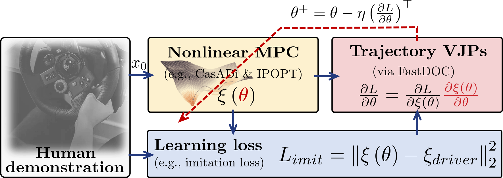
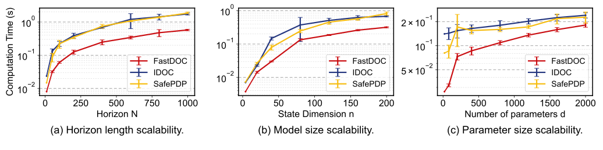
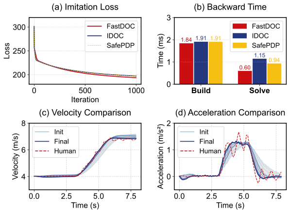
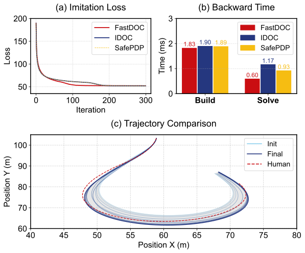

# FastDOC: A Gauss-Newton-Induced Structure-Exploiting Algorithm for Differentiable Optimal Control

## 1. Project Overview

This repository implements **FastDOC**, a Gauss–Newton–induced structure-exploiting algorithm for Differentiable Optimal Control.  
It includes the core solver, numerical experiment, imitation-learning experiment, and notebooks.

Descriptions of each folder:

- **FastDOC**  
  Core implementation for computing trajectory derivatives in OCP problems.  
  It builds upon:  
  - [SafePDP](https://github.com/wanxinjin/Safe-PDP)  and [IDOC](https://github.com/mingu6/Implicit-Diff-Optimal-Control)  
  - an interface for adding constant terms in the cost function.
  - efficient Gauss–Newton–based trajectory derivatives solver.
- **Numerical Experiment**  
  Contains the synthetic benchmark experiment from the paper.  
  Includes `Numercial_exp.py` for matrix generation, runtime evaluation, and comparison against baselines.
- **Learning Experiment**  
  Code for the imitation-learning experiments presented in the paper.
  - **CollectCarlaData**  
  Scripts for collecting driving data using **Carla simulator + Logitech G29 steering wheel**.
  - **vehicle_log_*.csv**  
  Driving logs collected from the Carla environment.
  - **Learning_exp.py**  
  Model definitions, policy training, and comparison with baseline algorithms.
- **Notebook**  
  Jupyter notebooks for reproducing numerical and learning experiments:  
  - `.ipynb` files show detailed execution steps  
  - `plot.py` contains scripts used to produce the figures in the paper  



---

## 2. Environment Setup

Please ensure your Python environment satisfies the following requirements:

| Package    | Version   | Link                                             |
| ---------- | --------- | ------------------------------------------------ |
| python     | >= 3.8    | [https://www.python.org](https://www.python.org) |
| casadi     | >= 3.7.2  | [https://web.casadi.org](https://web.casadi.org)        |
| numpy      | >= 1.24.2 | [https://numpy.org](https://numpy.org)                                                 |
| pandas     | >= 2.0.3  | [https://pandas.pydata.org](https://pandas.pydata.org)                          |
| scipy      | >= 1.10.1 | [https://scipy.org](https://scipy.org)                               |
| matplotlib | >= 3.7.5  | [https://matplotlib.org](https://matplotlib.org)         |

If you wish to collect your own driving data, you also need:

- **carla >= 0.9.15**  
  Refer to Carla’s official installation [Guide](https://carla.readthedocs.io/en/0.9.15/start_quickstart/) and the example code provided in `CollectCarlaData`.

### Recommended: Setup with Anaconda

```bash
conda create -n FastDOC python==3.8
pip install -r requirements.txt
```

## 3. How to Reproduce the Paper Results?

Please refer to the `notebook/` folder and follow the steps below:

1. Run `NumericalExp.ipynb`
2. Run `Numerical_plot.py` to generate **Fig. 2**
3. Run `LearningFromDemonstration.ipynb`
4. Run `Learning_plot.py` to generate **Fig.6** and **Fig. 7**

### Fig. 2



### Fig. 6 and Fig. 7





## 4. How to Apply FastDOC to New Models?

Refer to the `Bicycle_Model` implementation inside `Learning_exp.py`.  
To use FastDOC on a new system, you need to define:

- **Dynamic Model**
- **Cost Function**
- **Constraints**
- **Residual-weighted cost (`rw_cost`)** — required for standard Gauss–Newton mode  
  (i.e., the square-root form of your original cost)

Below is an example illustrating the required structure:

```python
class Model:
    def __init__(self, project_name='bicycle'):
        self.project_name = project_name

    def initDyn(self, L=2.5):
        """Define states X=[X,Y,phi,v,a,delta], controls U=[j,ddelta], and continuous-time dynamics f."""
        self.dyn_auxvar = vcat([])
        X, Y, phi, v, a, delta = SX.sym('X'), SX.sym('Y'), SX.sym('phi'), SX.sym('v'), SX.sym('a'), SX.sym('delta')
        self.X = vertcat(X, Y, phi, v, a, delta)

        j, ddelta = SX.sym('j'), SX.sym('ddelta')
        self.U = vertcat(j, ddelta)

        f = vertcat(
            v * cos(phi),
            v * sin(phi),
            v / L * tan(delta),
            a,
            j,
            ddelta
        )
        self.f = f

    def initCost(self):
        """Define quadratic tracking cost with look-ahead and control effort regularization."""
        parameter = []
        wX = SX.sym('wX'); wY = SX.sym('wY'); wphi = SX.sym('wphi'); wv = SX.sym('wv')
        wa = SX.sym('wa'); wdelta = SX.sym('wdelta'); wj = SX.sym('wj'); wddelta = SX.sym('wddelta')
        lookahead_distance = SX.sym('lookahead_distance')
        alpha = SX.sym('alpha')
        parameter += [wX, wY, wphi, wv, wa, wdelta, wj, wddelta, lookahead_distance, alpha]
        self.cost_auxvar = vcat(parameter)

        ref_state = [SX.sym('ref_x'), SX.sym('ref_y'), SX.sym('ref_phi'),
                     SX.sym('ref_v'), SX.sym('ref_a'), SX.sym('ref_delta'), SX.sym('cur_delta')]
        self.cost_other_value = vcat(ref_state)

        # stage cost
        self.path_cost = ......

        # terminal cost (without control effort)
        self.final_cost = ......

        # residual-weighted (square-root) form for stage/terminal
        self.rw_path_cost = ......

        self.rw_final_cost = ......

    def initConstraints(self):
        """Box constraints on controls and selected states (v,a,delta)."""
        max_U = ......
        min_U = ......
        max_X = ......
        min_X = ......

        path_inequ_Uub = self.U - max_U
        path_inequ_Ulb = -(self.U - min_U)
        path_inequ_Xub = self.X[[....]] - max_X
        path_inequ_Xlb = -(self.X[[...]] - min_X)

        self.path_inequ = vcat([path_inequ_Uub, path_inequ_Ulb, path_inequ_Xub, path_inequ_Xlb])
       
def build_coc_from_env(env: Model, dt: float, gamma: float):
    """Discretize dynamics with forward Euler and build SafeSafePDP COC system."""
    env_dyn = env.X + dt * env.f

    coc = SafePDP.COCsys()
    coc.setAuxvarVariable(env.cost_auxvar)
    coc.setStateVariable(env.X)
    coc.setControlVariable(env.U)
    coc.setDyn(env_dyn)

    coc.setCostOtherValue(env.cost_other_value)
    coc.setPathCost(env.path_cost)
    coc.setFinalCost(env.final_cost)
    coc.setRwPathCost(env.rw_path_cost)
    coc.setRwFinalCost(env.rw_final_cost)

    coc.setPathInequCstr(env.path_inequ)
    coc.setBlankdX0()
    coc.convert2BarrierOC(gamma=gamma)
    return coc
```

